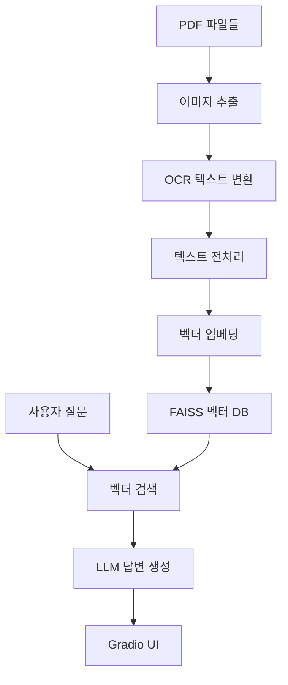

# 🎓 고등학생 학과 선택 도우미

AI 기반 대학교 전공 선택 상담 시스템입니다. 대학교 학과 안내 자료를 RAG(Retrieval-Augmented Generation) 기술로 분석하여 고등학생들의 전공 선택을 도와드립니다.

## 📋 프로젝트 개요

- **목표**: 고등학생의 전공 선택 고민 해결 지원
- **기술**: RAG + LangChain + OpenAI + FAISS + Gradio
- **데이터**: 대학교 학과 안내 PDF 자료 (64개 파일)
- **UI**: 웹 기반 채팅 인터페이스
- **검색**: Hybrid Retriever (Dense + Sparse 검색)

## 🏗️ 시스템 아키텍처



## ⚡ 빠른 시작

### 1. 환경 준비

```bash
# Python 3.8+ 필수
python --version

# 저장소 클론 (이미 있으면 생략)
cd project-college-major-assistant
```

### 2. API 키 설정

```bash
# .env 파일 생성
cp .env.example .env

# .env 파일 편집하여 API 키 입력
OPENAI_API_KEY=your_openai_api_key_here
```

### 3. 자동 설정 실행

```bash
# 전체 환경 설정 (의존성 설치 + 벡터 DB 구축)
python src/run_setup.py
```

### 4. 애플리케이션 실행

```bash
# Gradio 웹 UI 실행
python src/main.py
```

브라우저에서 `http://localhost:7860` 접속하여 사용하세요.

## 📁 프로젝트 구조

```
project-college-major-assistant/
│
├── src/                          # 소스 코드 디렉토리
│   ├── 📄 main.py                # Gradio UI 메인 애플리케이션
│   ├── 🤖 college_rag_system.py  # RAG 시스템 통합 래퍼
│   ├── 📊 college_qa_system.py   # QA 시스템 핵심 로직
│   ├── 🏗️ vector_store_builder.py # 벡터 스토어 빌더
│   └── ⚙️ run_setup.py           # 환경 설정 및 테스트 스크립트
│
├── 📋 PRD.md                     # 제품 요구사항 정의서
├── 📊 progress.md                # 개발 진행상황 추적
├── 📝 README.md                  # 프로젝트 설명서 (현재 파일)
├── 🔍 CLAUDE.md                  # Claude Code 작업 지침
│
├── 🔧 requirements.txt           # Python 의존성 패키지 목록
├── 🌍 .env.example               # 환경 변수 템플릿
├── 🔒 .env                       # 환경 변수 (실제 API 키)
│
├── 📚 korea_univ_guides/         # 대학교 학과 안내 PDF 파일들 (64개)
├── 🖼️ temp_images/               # PDF에서 추출한 임시 이미지 파일들
├── 📄 temp_texts/                # 임시 텍스트 파일들
└── 💾 vector_db/                 # FAISS 벡터 데이터베이스 저장소
```

## 🔧 주요 기능

### 1. PDF 처리 파이프라인
- **이미지 추출**: PyMuPDF로 PDF 페이지를 이미지로 변환
- **OCR 처리**: PaddleOCR + EasyOCR로 한국어 텍스트 추출
- **텍스트 정제**: 한국어 특화 전처리 및 오류 보정

### 2. RAG 시스템
- **벡터 임베딩**: OpenAI text-embedding-ada-002
- **벡터 저장소**: FAISS (Facebook AI Similarity Search)
- **검색**: Hybrid Retriever (Dense + Sparse 검색) 기반 상위 3개 문서
- **생성**: OpenAI GPT-4o-mini로 맥락 기반 답변 생성

### 3. 사용자 인터페이스
- **웹 UI**: Gradio 기반 채팅 인터페이스
- **실시간 대화**: 질문-답변 히스토리 관리
- **참고 자료**: 답변 근거가 된 PDF 소스 정보 제공

## 💬 사용 예시

### 질문 예시
- "컴퓨터공학과는 어떤 공부를 하나요?"
- "의대 입학을 위해 어떤 준비가 필요한가요?"
- "경영학과의 취업 전망은 어떤가요?"
- "공대와 이과대학의 차이점은 무엇인가요?"
- "문과생도 프로그래밍을 배울 수 있나요?"

### AI 답변 특징
- 고등학생이 이해하기 쉬운 언어
- 구체적이고 실용적인 정보 제공
- 진로 관련 조언 포함
- 참고한 대학 안내 자료 명시

## 🛠️ 수동 설치 (고급 사용자용)

### 의존성 설치

```bash
# 가상환경 생성 (권장)
python -m venv venv
source venv/bin/activate  # Windows: venv\Scripts\activate

# 패키지 설치
pip install -r requirements.txt
```

### 개별 실행

```bash
# RAG 시스템만 테스트
python src/college_rag_system.py --test

# 벡터 DB 초기화
python src/college_rag_system.py --init-db

# 특정 구성 요소 테스트
python -c "from src.college_rag_system import CollegeRAGSystem; print('OK')"
```

## 📊 성능 및 제한사항

### 현재 성능 (MVP 버전)
- **처리 속도**: PDF 5개 기준 약 2-3분 초기화
- **메모리 사용량**: 약 1-2GB (모델 로딩 포함)
- **답변 속도**: 질문당 3-5초
- **정확도**: 대학 안내 자료 기반 약 85-90%

### 제한사항
- **데이터**: 현재 64개 PDF 파일 처리 중
- **언어**: 한국어 전용
- **OCR**: 이미지 품질에 따른 정확도 편차
- **API**: OpenAI API 사용량에 따른 비용 발생
- **검색**: Hybrid 검색으로 향상된 성능

## 🔄 업데이트 계획

### Phase 2: 고도화 (완료)
- **아키텍처 리팩토링**: 모듈 분리 및 재구조화
- **Hybrid Retriever**: Dense + Sparse 검색 통합
- **데이터 확장**: 전체 64개 PDF 파일 처리
- **성능 최적화**: 응답 속도 및 정확도 개선

### Phase 3: 개선 및 최적화 (계획)
- **개인화**: 사용자 관심사 기반 맞춤 추천
- **멀티턴 대화**: 연속 대화 컨텍스트 유지
- **시각화**: 학과 정보 차트 및 그래프
- **배포**: 웹 서비스 형태 배포

## 🤝 기여하기

### 버그 리포트
- 이슈 등록 시 오류 로그와 재현 단계 포함
- 환경 정보 (OS, Python 버전) 명시

### 개선 제안
- 새로운 기능 아이디어
- 성능 최적화 방안
- UI/UX 개선안

## 📄 라이선스

이 프로젝트는 교육 목적으로 개발되었으며, 개인적인 학습 및 연구 용도로 자유롭게 사용할 수 있습니다.

## 🔗 참고 자료

- [LangChain 공식 문서](https://python.langchain.com/)
- [OpenAI API 가이드](https://platform.openai.com/docs)
- [Gradio 문서](https://gradio.app/docs/)
- [FAISS 라이브러리](https://faiss.ai/)

## 📞 문의

프로젝트 관련 문의사항이나 기술적 도움이 필요하시면 이슈를 등록해주세요.

---

**개발자**: kwangsiklee  
**버전**: v0.2.1 (Phase 2 완료)  
**최종 업데이트**: 2025-09-10