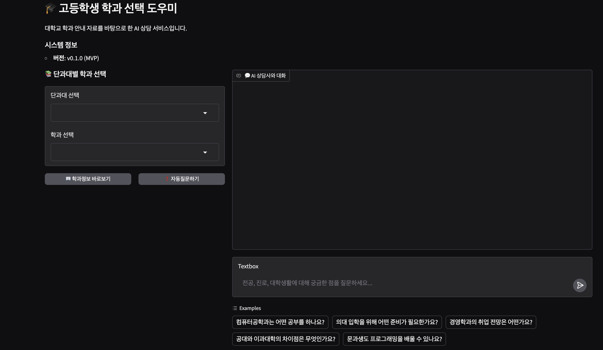
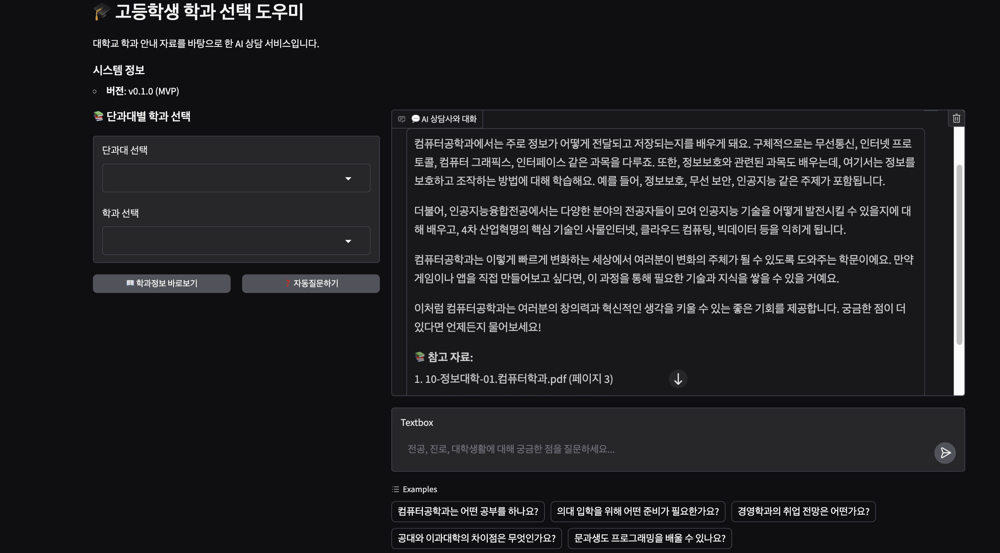
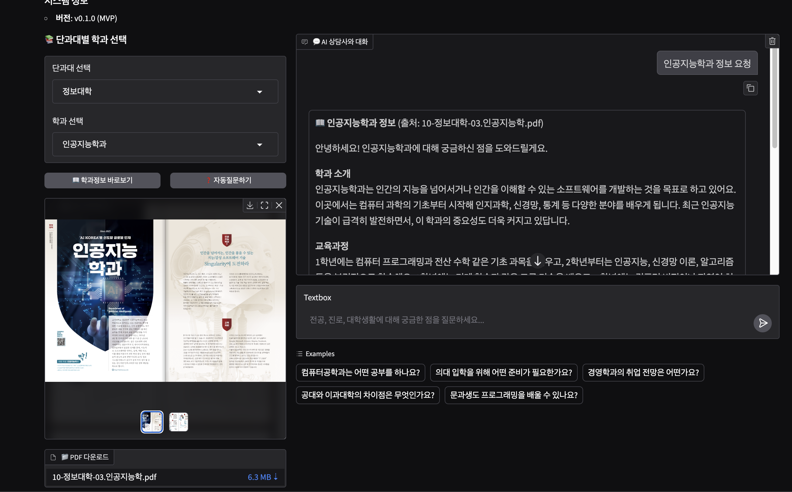
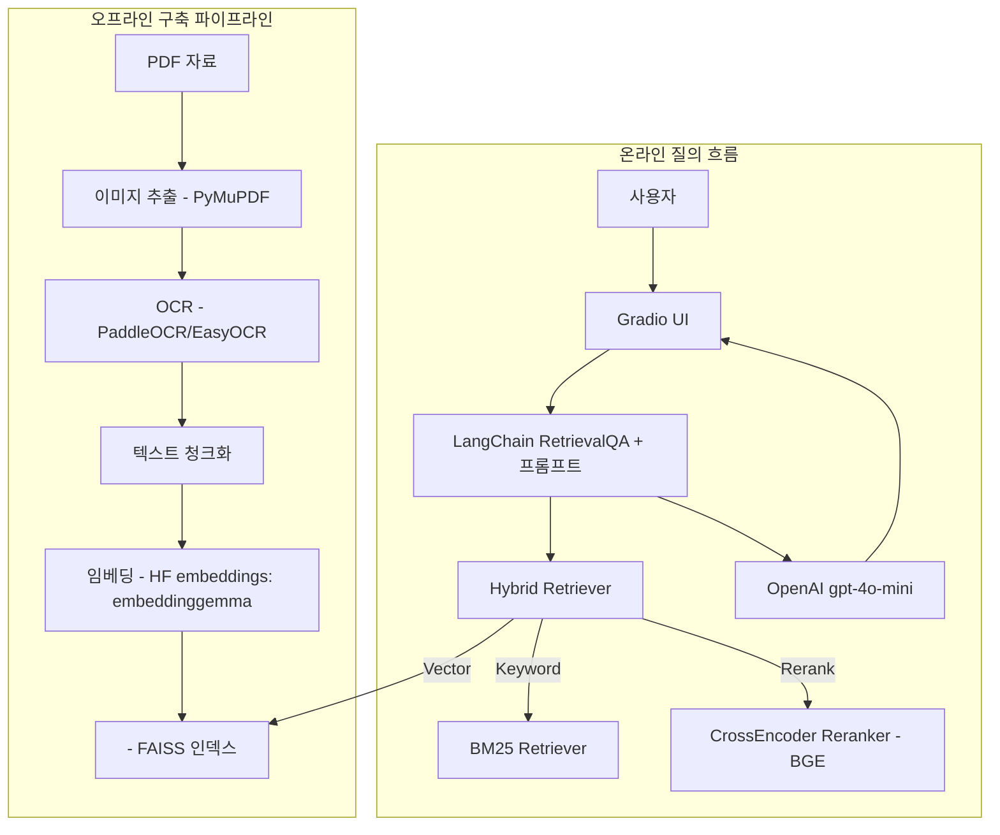
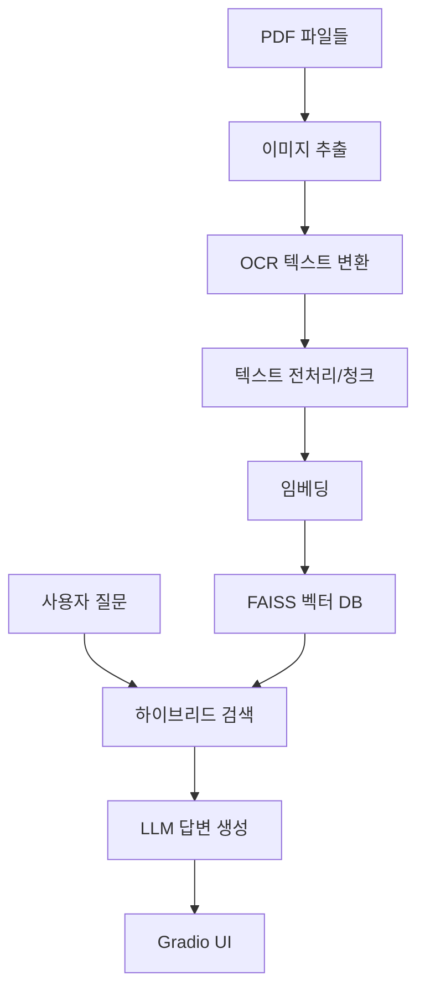

# 🎓 고등학생 학과 선택 도우미

대학교 학과 안내 자료를 RAG(Retrieval-Augmented Generation)로 분석해 고등학생의 전공 선택을 돕는 AI 상담 시스템입니다.

## 📋 프로젝트 개요

- 목표: 학과 정보 탐색과 비교 판단을 돕는 신뢰 가능한 Q&A
- 데이터: 대학 학과 안내 PDF 64개 (OCR → 정제 → 청크 → 임베딩)
- UI: 웹 기반 채팅 인터페이스(Gradio)
- 검색: Hybrid Retrieval(Dense + BM25) + Cross-Encoder Re-ranking


## 📸 스크린샷






## 🧰 사용 기술(Tech Stack)

- 언어/런타임: Python 3.10+
- 프레임워크: LangChain(체인/리트리버), Gradio(UI)
- LLM: OpenAI `gpt-4o-mini`
- 임베딩: Hugging Face Embeddings (기본: `google/embeddinggemma-300m`)
- 벡터 스토어: FAISS
- 검색: BM25 + 벡터 검색 앙상블(`EnsembleRetriever`), Cross-Encoder 리랭커(BGE 계열)
- OCR/PDF: PyMuPDF, PaddleOCR, EasyOCR, OpenCV, Pillow
- NLP/유틸: sentence-transformers, transformers, kss, tiktoken, numpy, pandas, scikit-learn, python-dotenv, tqdm

구현 기준(핵심 소스)
- `project-college-major-assistant/src/vector_store_builder.py`: PDF→이미지→OCR→청크→임베딩→FAISS 구축
- `project-college-major-assistant/src/college_qa_system.py`: Hybrid Retriever + LangChain RetrievalQA 체인 구성
- `project-college-major-assistant/src/main.py`: Gradio 기반 채팅 UI

## 🏗️ RAG 시스템 다이어그램



참고: BM25는 벡터 스토어의 문서에서 동적으로 구성되며, Hybrid(Ensemble/Hybrid) 방식으로 벡터 검색 결과와 융합 후 Cross-Encoder로 재순위화합니다.

## 🖼️ 시스템 개요 다이어그램(파이프라인)



## ⚡ 빠른 시작

### 1. 환경 준비

```bash
# Python 3.8+ 필수
python --version

# 저장소 클론 (이미 있으면 생략)
cd project-college-major-assistant
```

### 2. API 키 설정

```bash
# .env 파일 생성
cp .env.example .env

# .env 파일 편집하여 API 키 입력
OPENAI_API_KEY=your_openai_api_key_here
```

### 3. 자동 설정 실행

```bash
# 전체 환경 설정 (의존성 설치 + 벡터 DB 구축)
python src/run_setup.py
```

### 4. 애플리케이션 실행

```bash
# Gradio 웹 UI 실행
python src/main.py
```

브라우저에서 `http://localhost:7860` 접속하여 사용하세요.

## 📁 프로젝트 구조

```
project-college-major-assistant/
│
├── src/                          # 소스 코드 디렉토리
│   ├── 📄 main.py                # Gradio UI 메인 애플리케이션
│   ├── 🤖 college_rag_system.py  # RAG 시스템 통합 래퍼
│   ├── 📊 college_qa_system.py   # QA 시스템 핵심 로직
│   ├── 🏗️ vector_store_builder.py # 벡터 스토어 빌더
│   └── ⚙️ run_setup.py           # 환경 설정 및 테스트 스크립트
│
├── 📝 README.md                  # 프로젝트 설명서 (현재 파일)
├── 🔧 requirements.txt           # Python 의존성 패키지 목록
├── 🌍 .env.example               # 환경 변수 템플릿
├── 📚 korea_univ_guides/         # 대학교 학과 안내 PDF 파일들 (64개)
├── 🖼️ temp_images/               # PDF에서 추출한 임시 이미지 파일들
├── 📄 temp_texts/                # 임시 텍스트 파일들
└── 💾 vector_db/                 # FAISS 벡터 데이터베이스 저장소
```

## 🔧 주요 기능

### 1. PDF 처리 파이프라인
- **이미지 추출**: PyMuPDF로 PDF 페이지를 이미지로 변환
- **OCR 처리**: PaddleOCR + EasyOCR로 한국어 텍스트 추출
- **텍스트 정제**: 한국어 특화 전처리 및 오류 보정

### 2. RAG 시스템
- **임베딩**: Hugging Face Embeddings(기본 `google/embeddinggemma-300m`)
- **벡터 저장소**: FAISS (Facebook AI Similarity Search)
- **검색**: Hybrid Retrieval(Dense + BM25 앙상블) + Cross-Encoder 리랭킹
- **생성**: OpenAI GPT-4o-mini로 맥락 기반 답변 생성

### 3. 사용자 인터페이스
- **웹 UI**: Gradio 기반 채팅 인터페이스
- **실시간 대화**: 질문-답변 히스토리 관리
- **참고 자료**: 답변 근거가 된 PDF 소스 정보 제공

## 💬 사용 예시

### 질문 예시
- "컴퓨터공학과는 어떤 공부를 하나요?"
- "의대 입학을 위해 어떤 준비가 필요한가요?"
- "경영학과의 취업 전망은 어떤가요?"
- "공대와 이과대학의 차이점은 무엇인가요?"
- "문과생도 프로그래밍을 배울 수 있나요?"

### AI 답변 특징
- 고등학생이 이해하기 쉬운 언어
- 구체적이고 실용적인 정보 제공
- 진로 관련 조언 포함
- 참고한 대학 안내 자료 명시

## 🛠️ 수동 설치 (고급 사용자용)

### 의존성 설치

```bash
# 가상환경 생성 (권장)
python -m venv venv
source venv/bin/activate  # Windows: venv\Scripts\activate

# 패키지 설치
pip install -r requirements.txt
```

### 개별 실행

```bash
# RAG 시스템만 테스트
python src/college_rag_system.py --test

# 벡터 DB 초기화
python src/college_rag_system.py --init-db

# 특정 구성 요소 테스트
python -c "from src.college_rag_system import CollegeRAGSystem; print('OK')"
```

## 📊 성능 및 제한사항

### 현재 성능 (MVP 버전)
- **처리 속도**: PDF 5개 기준 약 2-3분 초기화
- **메모리 사용량**: 약 1-2GB (모델 로딩 포함)
- **답변 속도**: 질문당 3-5초
- **정확도**: 대학 안내 자료 기반 약 85-90%

### RAG Evaluation
=== Retriever Evaluation Summary ===
- **samples**: 10
- **hit_rate@k**: 0.9000
- **mrr@k**: 0.8500
- **precision@k**: 0.1800
- **recall@k**: 0.9000
- **avg_context_precision**: 0.5156
- **avg_best_similarity**: 0.8930


## 🔄 업데이트 계획

### Phase 2: 고도화 (완료)
- **아키텍처 리팩토링**: 모듈 분리 및 재구조화
- **Hybrid Retriever**: Dense + Sparse 검색 통합
- **데이터 확장**: 전체 64개 PDF 파일 처리
- **성능 최적화**: 응답 속도 및 정확도 개선

### Phase 3: 개선 및 최적화 (계획)
- **개인화**: 사용자 관심사 기반 맞춤 추천
- **멀티턴 대화**: 연속 대화 컨텍스트 유지
- **시각화**: 학과 정보 차트 및 그래프
- **배포**: 웹 서비스 형태 배포


## 📄 라이선스

이 프로젝트는 교육 목적으로 개발되었으며, 개인적인 학습 및 연구 용도로 자유롭게 사용할 수 있습니다.

## 🔗 참고 자료

- [LangChain 공식 문서](https://python.langchain.com/)
- [OpenAI API 가이드](https://platform.openai.com/docs)
- [Gradio 문서](https://gradio.app/docs/)
- [FAISS 라이브러리](https://faiss.ai/)

---

**개발자**: kwangsiklee  
**버전**: v0.2.1 (Phase 2 완료)  
**최종 업데이트**: 2025-09-22
